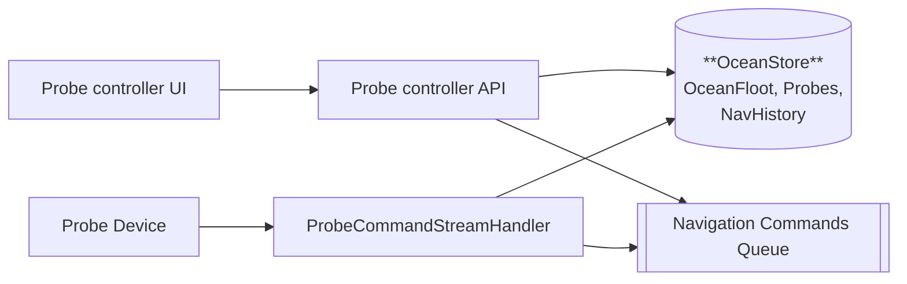
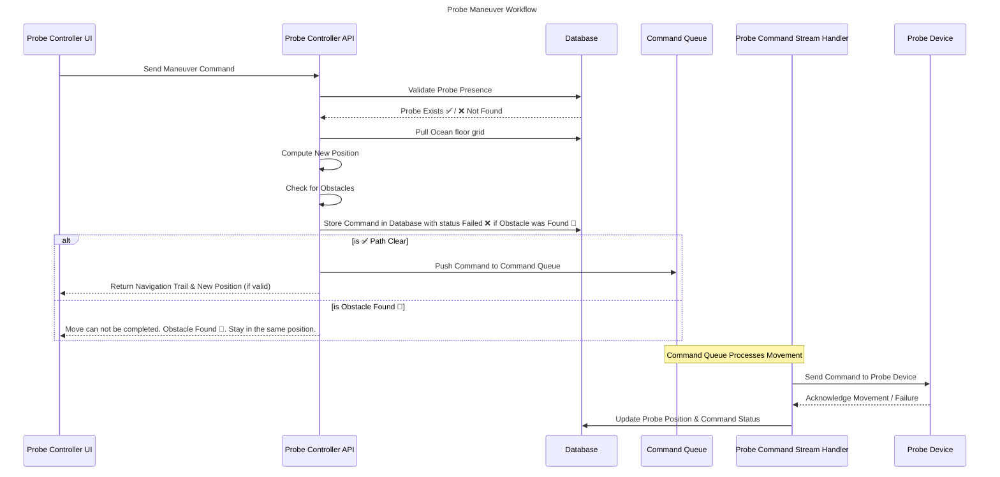
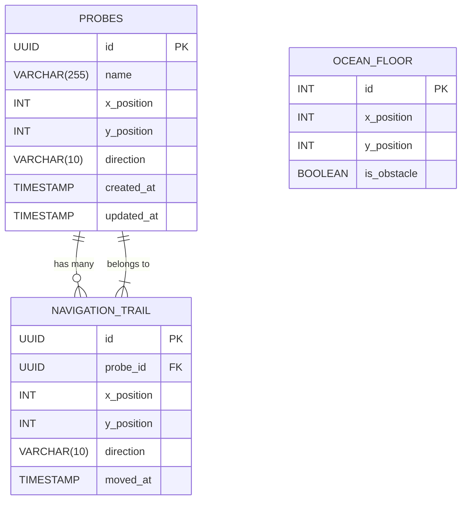

# 🚀 Ocean Probe Navigation Service
## 📌 Overview 
This service provide APIs Register a probe and control the probe navigation using set of commands.

---

## 📦 Features 
✅ **Register A Probe with navigation controller service** : Register and create Probe device identity.

✅ **Ocean floor representation with obstacles as 2D grid** : Ocean floor represented as 2D grid.

✅ **Move the probe in directions** : Move forwards and backwards.

✅ **Change directions** : Turn left and right.

✅ **Avoid obstacles** : Avoid obstacles in the grid.

✅ **Stay on the grid**

✅ **Print navigation trail** : Print a summary of the co-ordinates visited.

---

## 📚 API Documentation 
- Swagger UI: --TODO--

---

## 🚀 Quick Start Guide
### **1️⃣ Prerequisites**
Ensure you have the following installed:
- [JDK 17+](https://adoptium.net/)
- [Maven 3+](https://maven.apache.org/)

### **2️⃣ Clone the Repository**
```sh 
git clone git@github.com:jabeevulla/kata-probe-navigation-service.git
cd kata-probe-navigation-service

```
### **4️⃣ Run the Application**
```sh
mvn clean install
mvn spring-boot:run
```

### **5️⃣ Test the API**
```sh
TODO - Add CURL
```

### **6️⃣ Access Local Database**
-	Start your Spring Boot application.
-	Open the browser and go to:
👉 http://localhost:8080/h2-console
-	Enter the following credentials:
-	JDBC URL: jdbc:h2:mem:probe_db
-	Username: sa
-	Password: password

---
### **🛠️ Project Structure**
```
├── HELP.md
├── README.md
├── mvnw
├── mvnw.cmd
├── pom.xml
├── src
│   ├── main
│   │   ├── java
│   │   │   └── com
│   │   │       └── codekata
│   │   │           └── oceanprobe
│   │   │               └── probenavigationservice
│   │   │                   ├── KataProbeNavigationServiceApplication.java
│   │   │                   ├── controller
│   │   │                   ├── dto
│   │   │                   ├── entity
│   │   │                   ├── exception
│   │   │                   ├── repository
│   │   │                   └── service
│   │   └── resources
│   │       ├── application.properties
│   │       ├── static
│   │       └── templates
│   └── test
│       └── java
│           └── com
│               └── codekata
│                   └── oceanprobe
│                       └── probenavigationservice
│                           └── KataProbeNavigationServiceApplicationTests.java

```

---

### **✅ Running Tests**
Run **unit & integration** tests:

```sh
mvn test
```

---
### **📦 Deployment**
#### **TODO**: 

---

## 🛠️ System design

### **Problem statement**
Develop a REST API that allows control of the probe from the surface using a set of interpreted controls.
End users are a team that explores the bottom of the sea using a remotely controlled submersible probe.

---

### **Solution Overview** 
The system scopes the implementation of basic navigation controller service for remotely operating the probe on predefined ocean floor. 
- **Probe controller UI** integrate with **Probe controller API** to send commands
- **Probe controller API** validate maneuver command by checking **Probe** presence in **Database**
- **Probe controller API** computes the new position and checks for obstacles 
- **Probe controller API** moves **Probe** by storing command into database and **Command Queue**
- **Probe Command Stream Handler** orchestrate commands to Probe device and updates database for status of command
- **Probe controller API** returns **Navigation Trail** and **new position** if command is valid and next move is not an obstacle

**Note:** The diagrams are Mermaid.js diagram. Copy the script to [mermaid.live](https://mermaid.live/) visualise the diagram.

**High level Solution diagram**


**Sequence Diagram** 

---
### [**📦 Features**](#features)

| **Feature ID** | **Feature**                                            | **Details**                                        |
|----------------|--------------------------------------------------------|----------------------------------------------------|
| **F-001**      | ✅ Register A Probe with navigation controller service  | Register and create Probe device identity.         |
| **F-002**      | ✅ Ocean floor representation with obstacles as 2D grid | Ocean floor represented as a 2D grid.              |
| **F-003**      | ✅ Move the probe in directions                         | Move forwards and backwards.                       |
| **F-004**      | ✅ Change directions                                    | Turn left and right.                               |
| **F-005**      | ✅ Avoid obstacles                                      | Avoid obstacles in the grid.                       |
| **F-006**      | ✅ Stay on the grid                                     | Ensure the probe does not leave the grid boundary. |
| **F-007**      | ✅ Print navigation trail                               | Print a summary of the coordinates visited.        |

---

### **💬 Assumptions**
#### **Requirements assumptions** 
- The predefined ocean floor as grid is a static configuration in the backend 
- Surface controlling unit and probe device unit assumed to be integrated/bound via backend system
- Probe device have intelligence to return to base location using navigation history in the event of probe loosing connection with backend service 
#### **Solution design assumptions**
- Security assumption : Security is not scoped into this design assuming that over all probe integration platform will have security implemented. For example: Authentication and Authorisation, API gateways etc.
- For the purpose of enabling this service testing, simple probe registration api is implemented. This should ideally be separate system all together for probe device management.

---
## **📽️ Low level design**
The navigation controller system is designed to be REST API application, providing APIs for various probe controlling operations. 

### **💻 Tech stack**

| **Purpose**                     | **Recommended Technology**        | **Technology Used in Design** |
|---------------------------------|-----------------------------------|-------------------------------|
| **Streaming & Event Queue**     | Kafka, RabbitMQ                   | BlockingQueue (Java)          |
| **REST API Framework**          | Spring Boot                       | Spring Boot                   |
| **Database**                    | PostgreSQL, MySQL                 | H2 (In-Memory)                |
| **Real-time Updates**           | Kafka streaming                   | WebSockets                    |
| **API Documentation**           | OpenAPI (Swagger), Postman        | Swagger                       |
| **Infrastructure & Deployment** | Kubernetes, Docker                | Spring Boot embedded Tomcat   |
| **Configuration Management**    | Spring Config, Consul             | application.yml               |
| **Logging & Monitoring**        | ELK Stack, Prometheus + Grafana   | Spring Boot Logs              |
| **Authentication & Security**   | OAuth2, Keycloak, Spring Security | N/A                           |

### **💽 Data structure** 
#### **OCEAN FLOOR**: 

Ocean floor is represented as 2D grid.

The grid is represented as a 2D matrix, where:
-	0 = Open space
-	1 = Obstacle (wall)
-	S = Start point
-	E = End point

Example: 
```txt
S  0  1  0  0
0  1  0  1  0
0  0  0  1  E
```
**Implementation:**

```java
int[][] grid = {
    {0, 0, 1, 0, 0},
    {0, 1, 0, 1, 0},
    {0, 0, 0, 1, 0}
};
```
#### **DIRECTIONS**
Directions are represented as 2D array.
Each entry in the DIRECTIONS array represents a movement (Row, Column):

**🔄 Directional Movement Table**

| **Direction** | **Row (x)** | **Column (y)** | **Meaning**                  |
|---------------|-------------|----------------|------------------------------|
| **Right**     | `0`         | `+1`           | Move right (increase column) |
| **Down**      | `+1`        | `0`            | Move down (increase row)     |
| **Left**      | `0`         | `-1`           | Move left (decrease column)  |
| **Up**        | `-1`        | `0`            | Move up (decrease row)       |

**Implementation:**

```java
// Directions for moving Up, Down, Left, Right
private static final int[][] DIRECTIONS = {{0, 1}, {1, 0}, {0, -1}, {-1, 0}};
```

### **📂Database Design**


### **🔁 Algorithms Used**
No search algorithms are considered as all the options required for features deal with precise know location (Current position).

### **🔄 Data Flow** 
TODO

# 🛠️ Test Approach Documentation

## 📌 Overview
This document outlines the **testing strategy** for the **Probe Maneuver System**, ensuring all components are tested for **functionality, performance, integration, and reliability**.

---

## ✅ Test Strategy
| **Test Type**           | **Description**                                                                                  |
|-------------------------|--------------------------------------------------------------------------------------------------|
| **Unit Testing**        | Tests individual methods and logic in **Controller, Service, and Repository layers**.            |
| **Integration Testing** | Ensures **API endpoints, database interactions, and event queues** work together correctly.      |
| **System Testing**      | Validates end-to-end flow for **Probe registration, movement, and navigation trail generation**. |
| **Performance Testing** | Out of scope: Recommended to capture this for real use case.                                     |
| **Security Testing**    | Out of scope: Recommended to capture this for real use case.                                     |
| **Regression Testing**  | Out of scope: Recommended to capture this for real use case.                                     |

---

### 🧪 **Unit & Integration Testing Approach**
#### **✅ Scope**
- Test individual **methods in the Service layer**.
- Test individual API **Controller layer**.
- Ensure **pathfinding logic** correctly computes new positions.
- Validate **probe movement restrictions** (boundaries, obstacles).

#### **🛠️ Tools & Frameworks**
- **JUnit 5**
- **Mockito** (for mocking dependencies)
- **Spring Boot Test** (for unit + integration tests)

#### **📝 Example Unit Test Case**
```java
TODO
```

### 🧪 **System Testing Approach**
#### **✅ Scope**
- Test APIs using CURL/ Postman. 
- Recommended to write automation API testing using Karate or similar framework

### 📜 API Versioning

**📌 URL Path Versioning (Used in System)**
- Example: API versions are included in the URL, e.g., /api/v1/probes/move
---

### 📌 Requirement Traceability Matrix (RTM)

#### 📦 Overview
A **Requirement Traceability Matrix (RTM)** ensures that all business requirements are mapped to **work items, test cases, and builds**, providing full traceability and verification across the software development lifecycle.

In this design, we document RTM within the **README** for simplicity. However, the **recommended approach** is to use **advanced tools** for better tracking, automation, and integration.

---

#### 🔗 **Recommended RTM Implementation Approach**
| **Category**                | **Recommended Tool**       | **Purpose**                                   |
|-----------------------------|----------------------------|-----------------------------------------------|
| **Requirements Management** | IBM DOORS Next, Confluence | Captures business capabilities & requirements |
| **Project Management**      | Jira, Azure DevOps         | Tracks work items (Epics, Features, Stories)  |
| **Test Management**         | TestRail                   | Manages test cases & execution                |
| **CI/CD & Automation**      | GitHub Actions, Jenkins    | Automates RTM generation & validation         |

---

#### 🔄 **RTM Structure in the Design**
For this project, we will structure RTM as follows:

| **Business Capability** | **Business Requirement**              | **Work Item (Epic, Feature, Story)**                                                                  | **Test Case**                                    | **Build** |
|-------------------------|---------------------------------------|-------------------------------------------------------------------------------------------------------|--------------------------------------------------|-----------|
| **Probe Navigation**    | "Register a probe"                    | Epic: **Register Probe** → Feature: **API for registration** → Story: **POST /api/probes/register**   | TC-001: Register a probe successfully            |           |
| **Probe Maneuver**      | "Move probe while avoiding obstacles" | Epic: **Maneuver Probe** → Feature: **Obstacle detection** → Story: **Compute movement path**         | TC-002: Move probe, <br/>TC-003: Detect obstacle |           |
| **Navigation Trail**    | "Retrieve navigation history"         | Epic: **Probe Navigation Trail** → Feature: **Store path history** → Story: **GET /api/probes/trail** | TC-004: Validate correct trail history           |           |

---